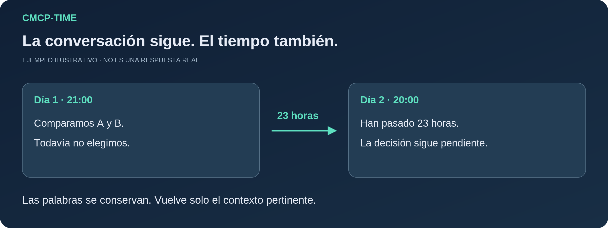
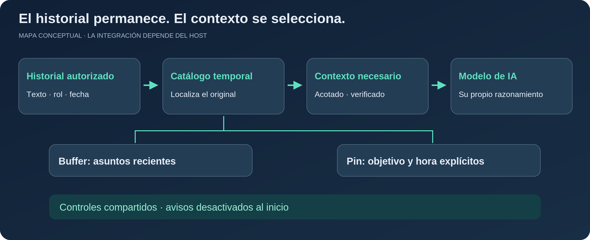

# CMCP-TIME

### Conserva las palabras originales. Entiende el tiempo transcurrido.

[English](README.md) · [繁體中文](README.zh-TW.md) · [Español](README.es.md) · [日本語](README.ja.md)

**Una skill de continuidad temporal para agentes de IA.** CMCP ayuda a un agente existente a retomar una conversación con las fuentes, las fechas y el estado adecuados, sin volver a introducir todo el historial en cada solicitud al modelo.

**Versiones preliminares · Apache-2.0 · Autor original: [redwakame](https://github.com/redwakame)**

## Tres situaciones cotidianas

| Tu situación | Qué aporta CMCP |
| --- | --- |
| Vuelves mañana para cambiar una parte de un borrador. | Localiza el original y su versión, en lugar de reconstruirlo a partir de un resumen impreciso. |
| Retomas la conversación después de una pausa larga. | Proporciona las fechas originales y el tiempo transcurrido, sin inventar lo sucedido durante la pausa. |
| Dejas un trabajo pendiente o fijas explícitamente un seguimiento. | Gestiona Buffer y Pin por separado, con controles independientes y envío automático desactivado por defecto. |

Son ejemplos de uso, no respuestas grabadas de un modelo. Siguen siendo necesarias las fuentes autorizadas y una integración funcional; la interpretación del modelo puede ser incorrecta.

**Empieza con la integración documentada de Codex o con Playground.** Un núcleo independiente del anfitrión no significa que todos los agentes ya tengan un adaptador funcional. [Instalación](#start-here) · [Comandos](docs/commands.md) · [Límites de los hosts](docs/installation-and-hosts.md).



## Por qué existe

Una propuesta de ayer no es una decisión de hoy. Un borrador ya entregado no debería volver a tratarse como una tarea pendiente de empezar. Que una conversación salga del contexto activo del modelo no es motivo para perder sus palabras originales.

CMCP conserva las fuentes de texto autorizadas, sus roles y sus marcas de tiempo. Un catálogo de fuentes y tiempos permite localizarlas. Antes de responder, entrega al modelo únicamente el contexto pertinente y acotado; cuando importa la redacción exacta, vuelve a la fuente original.

**No sustituye los conocimientos, el razonamiento, la personalidad ni las políticas de seguridad del modelo anfitrión.** Tampoco reescribe sus respuestas para simular un estilo. El modelo todavía puede equivocarse: el objetivo es fundamentar mejor la continuidad, no prometer una memoria perfecta.

## Qué ofrece esta versión

| Necesidad | Función | Límite importante |
|---|---|---|
| Retomar una conversación tras una pausa | Tarjetas temporales por turno y captura autorizada | Requiere los controles habilitados y una conexión operativa |
| Comprobar qué se dijo y cuándo | Catálogo, candidatos locales y lectura exacta | La fecha del mensaje no prueba cuándo ocurrió el hecho |
| Ver lo esencial | **READ**: esquema respaldado por fuentes, fechas y cobertura | El resumen no reemplaza el original |
| Ver el contexto completo de la selección | **READ-ALL**: colección autorizada y congelada, paginada | No equivale a todo el historial de una cuenta |
| Comprobar o contar mensajes del historial | Verificación por lotes con cobertura y reanudación | Menciones, planes y relatos del usuario no son equivalentes |
| Mantener asuntos recientes pendientes | **Buffer**: 12 horas por defecto, ajustable entre 6 y 48 | Caducar o vaciarlo no borra History ni los Pins independientes |
| Fijar un seguimiento concreto | **Pin**: objetivo explícito y hora opcional | Sin hora no se programa un aviso; enviar no significa completar |
| Controlar la intervención | Guardado, recuperación, tiempo, Buffer, Pin, Clean, OFF y DND | Los avisos automáticos están **desactivados por defecto** |

Esta versión no necesita una base de datos vectorial ni descargar un modelo de embeddings. Ya combina localización local e interpretación semántica asistida por el modelo; eso no garantiza una recuperación semántica exhaustiva.

## Componentes con responsabilidades distintas



**History** conserva el texto autorizado; el **catálogo temporal y de fuentes** lo localiza. **Buffer** representa continuidad reciente elegible. Los **Pins** son objetivos fijados explícitamente. No son cuatro copias de la misma conversación.

El catálogo no caduca con las entradas de Buffer. Una charla cotidiana puede quedar fuera de Buffer y seguir siendo consultable. Solo se aporta al modelo lo necesario ahora. Las propuestas del asistente no se convierten en decisiones del usuario, y las fechas desconocidas siguen siendo desconocidas.

<a id="start-here"></a>
## Instalación y configuración

**Paquete oficial de npm:** [`@redwakame-skill/cmcp-time`](https://www.npmjs.com/package/@redwakame-skill/cmcp-time). **Comando:** `cmcp-time`. **Repositorio:** `redwakame/CMCP-TIME`.

**`0.1.0-rc.3` está publicada en npm y sigue siendo una versión candidata preliminar.** Usa `@redwakame-skill/cmcp-time@next` para el canal de candidatos o `@redwakame-skill/cmcp-time@0.1.0-rc.3` para fijar esta versión. Su código fuente en GitHub corresponde a [v0.1.0-rc.3](https://github.com/redwakame/CMCP-TIME/tree/v0.1.0-rc.3); `main` puede incluir actualizaciones posteriores de documentación. Esta versión incluye `cmcp-time context --help`.

Comprobación del registry a las **2026-09-22 06:01:41 +08:00 (Asia/Taipei)**: `next = 0.1.0-rc.3`, `latest = 0.1.0-rc.2`. Según esta comprobación, instalar sin versión ni etiqueta selecciona el candidato anterior rc.2; `latest` no certifica estabilidad. Las etiquetas pueden cambiar: usa la versión exacta para fijar la instalación y `cmcp-time --version` para consultarla. Las [notas de versión](RELEASE-NOTES.md) conservan el registro histórico de preparación.

### Instala y después abre el asistente

Ejemplo para Windows PowerShell, desde un directorio donde quieras conservar la instalación y el espacio de trabajo por separado. Elige ubicaciones nuevas o cuyo uso ya hayas confirmado. No requiere administrador ni modificar el PATH del sistema.

```powershell
$cmcpPrefix = Join-Path $PWD 'cmcp-install'
$cmcpWorkspace = Join-Path $PWD 'cmcp-workspace'
New-Item -ItemType Directory -Force -Path $cmcpPrefix, $cmcpWorkspace | Out-Null
npm.cmd install --global --prefix "$cmcpPrefix" @redwakame-skill/cmcp-time@next --ignore-scripts --no-audit --no-fund
& (Join-Path $cmcpPrefix 'cmcp-time.cmd') --version
& (Join-Path $cmcpPrefix 'cmcp-time.cmd') setup --workspace "$cmcpWorkspace"
& (Join-Path $cmcpPrefix 'cmcp-time.cmd') status --workspace "$cmcpWorkspace"
```

La instalación descarga el paquete; `setup` abre el asistente interactivo para revisar guardado, alcance, zona horaria, idioma y funciones opcionales. **Instalar no autoriza el acceso a conversaciones privadas, las llamadas de pago ni los mensajes proactivos.**

La comprobación de publicación incluyó una instalación anónima desde el registry. El diseño global-prefix persistente anterior se verificó en las pruebas previas del candidato Windows con el mismo contenido, no en una matriz multiplataforma completa. Consulta la [guía npm](docs/npm-installation.md), en inglés.

**Codex:** selecciona host y revisa la integración Skill/Hook generada en el proyecto. Utiliza el modelo del anfitrión, sin una clave adicional de DeepSeek. **Playground:** el modo configured-provider necesita proveedor explícito, credencial protegida y presupuesto finito. La ruta de credenciales suministrada depende de Windows DPAPI y PowerShell 7; DeepSeek es la referencia implementada, no una obligación del núcleo.

### Actualizar o detener sin borrar el historial

Mantén separados el prefijo de instalación y el espacio de trabajo. Tras instalar una versión aprobada en el mismo prefijo, ejecuta `cmcp-time update --workspace <tu-espacio>` para actualizar las rutas de integración. `update` no descarga versiones npm. `disable` detiene los hooks gestionados y `uninstall` retira la integración gestionada; ninguno elimina el espacio de History. No vincules hooks permanentes a la caché temporal de `npx`. Consulta [comandos](docs/commands.md) y [configuración](docs/configuration.md).

### Obtener el código fuente

```sh
git clone https://github.com/redwakame/CMCP-TIME.git
cd CMCP-TIME
```

También puedes usar `gh repo clone redwakame/CMCP-TIME`, SSH `git clone git@github.com:redwakame/CMCP-TIME.git` o **Code → Download ZIP**. Elige los [tags de publicación](https://github.com/redwakame/CMCP-TIME/releases) para fijar una versión; `main` puede incluir documentación posterior. `npm install cmcp` no es el nombre completo de este paquete.

Desde la raíz del código fuente:

```sh
node scripts/cmcp-setup.mjs --help
node scripts/cmcp-setup.mjs --root local-data/my-cmcp --host-workspace local-data/my-cmcp-host
```

Instala Node.js por separado. El mínimo declarado es Node 18; las pruebas npm utilizaron Windows, Node 24.18.0, npm 11.16.0 y PowerShell 7.6.6. La evidencia existente de Codex corresponde a CLI 0.154.0. No son garantías para todas las versiones. El asistente no instala Node ni agentes. Este candidato no requiere dependencias npm de ejecución ni descargar un modelo de embeddings.

## Controles utilizables

Estos comandos pertenecen a **CMCP Playground**, no al intérprete nativo de todos los agentes:

```text
/controls
/read ¿Qué hablamos ayer sobre el plan de entrega?
/read-all Muestra el contexto completo de esa discusión.
/next
/set bufferRetentionHours 24
/proactive off
/pins
/clean on
```

Para fijar un objetivo, usa un número real devuelto por `/topics` con `/pin`, o una fuente registrada con `/pin-source`. `/pin-time`, `/pin-complete` y `/pin-cancel` cambian su hora o estado. Los parámetros se documentan en la [referencia de comandos](docs/commands.md); no hay que inventar identificadores.

Los avisos necesitan un Runtime y un canal activos. Buffer y Pin comparten el interruptor principal, el horario de no molestar, las comprobaciones de fuentes y la deduplicación. Una salida de consola no es una notificación móvil, una confirmación de lectura ni un servicio permanente.

## Verificación y límites

Es una **versión candidata de ingeniería utilizable**, no una garantía universal de producción. Las pruebas del programa, la integridad de las fuentes, la semántica del modelo y la integración del anfitrión se describen por separado en [verificación](docs/verification.md).

La base revisada incluye recuperación acotada, tarjetas temporales, controles separados, avisos locales Buffer/Pin y una ruta probada de hooks y compactación manual de Codex. El empaquetado también tuvo verificaciones reales del asistente y helper en Windows sin token de administrador. Las pruebas sintéticas no son nuevas pruebas con modelos reales.

**No se afirma** compatibilidad completa con todos los hosts, sistemas operativos o versiones; compactación automática totalmente fiable; capacidad ilimitada; interpretación perfecta; sincronización en la nube; avisos móviles; ni gestión integral de borrado de History. Claude Code, OpenClaw, Hermes, DeepSeek Harness y Grok Bot siguen siendo destinos de adaptación, no una lista de integraciones verificadas. La traducción de documentos no certifica el comportamiento del producto en cada idioma.

## Qué repositorio consultar

**CMCP-TIME es la línea actual de desarrollo.** [OpenClaw Continuity](https://github.com/redwakame/openclaw-continuity) conserva la skill anterior específica de OpenClaw; [cmcp](https://github.com/redwakame/cmcp) conserva el contrato de políticas y el material de revisión anteriores. Su código, licencias y evidencia siguen separados. No se anuncia CMCP-TIME como sustitución directa de la skill anterior ni se implica una migración automática de datos.

## Autoría y colaboración

Las ideas, incidencias reproducibles, evaluaciones independientes y propuestas de colaboración son bienvenidas. No publiques conversaciones privadas ni credenciales. Consulta [CONTRIBUTING](CONTRIBUTING.md), [SECURITY](SECURITY.md), [privacidad](docs/privacy.md) y [hoja de ruta](docs/roadmap.md).

¿Te interesa CMCP-TIME? Me encantará intercambiar ideas y conocer tu experiencia. Si el proyecto te resulta útil, puedes apoyarlo con una estrella en GitHub. Seguiré mejorándolo y actualizándolo; también son bienvenidas las propuestas de colaboración comercial. Escríbeme a [adarobot666@gmail.com](mailto:adarobot666@gmail.com) o [redwakame616@gmail.com](mailto:redwakame616@gmail.com).

Autor original y mantenedor: **redwakame**. Distribución actual bajo [Apache-2.0](LICENSE), con [NOTICE](NOTICE) y [procedencia de licencias](docs/license-provenance-v0.1.md). No se revocan permisos anteriores ni se añade una obligación publicitaria por cada uso. El identificador interno sigue siendo `cmcp`; el nombre público es **CMCP-TIME**. [CITATION.cff](CITATION.cff) facilita su cita.
