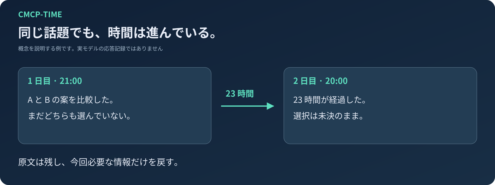
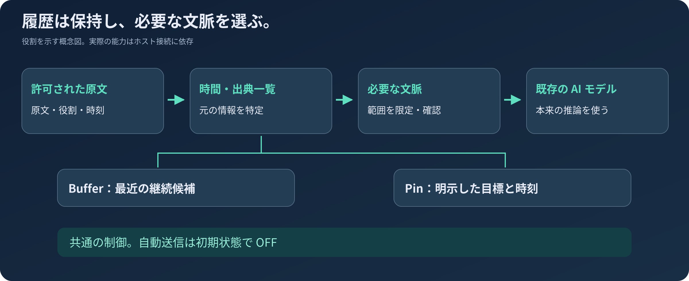

# CMCP-TIME

### 元の言葉を残し、時間の隔たりも引き継ぐ。

[English](README.md) · [繁體中文](README.zh-TW.md) · [Español](README.es.md) · [日本語](README.ja.md)

**既存の AI エージェントに時間を踏まえた対話の継続を加えるスキルです。** CMCP は、元の発言、時刻、現在の状態を使って過去の話題を再開できるよう支援します。毎回すべての履歴をプロンプトに入れ直す仕組みではありません。

**プレビュー版 · Apache-2.0 · 原作者：[redwakame](https://github.com/redwakame)**

## 三つの使いどころ

| 状況 | CMCP が補うもの |
| --- | --- |
| 翌日、昨日の下書きの一部分だけを修正したい。 | 曖昧な要約から作り直すのではなく、対応する原文と版を探します。 |
| 長い間隔を空けて対話を再開する。 | 元の対話時刻と経過時間を渡し、その間に何があったかを勝手に推測しません。 |
| 作業を中断する、または後で確認する対象を明示的に Pin にする。 | Buffer と Pin を分け、独立した操作を用意します。自動送信は初期状態では OFF です。 |

これは用途の説明であり、実際に記録したモデル出力ではありません。許可された原文と正常なホスト接続が必要で、モデルの解釈には誤りがあり得ます。

**まずは文書化された Codex 接続か単独 Playground から始めてください。** ホストに依存しない Core であることは、すべてのエージェントで接続済みという意味ではありません。[インストール](#start-here) · [コマンド](docs/commands.md) · [ホストの制限](docs/installation-and-hosts.md)。



## なぜ CMCP を作るのか

昨日の提案は、今日の決定とは限りません。すでに渡した草案を、まだ作っていない仕事として扱うべきでもありません。モデルのコンテキストから外れたというだけで、元の会話を後から参照できなくなるべきではありません。

CMCP は許可されたテキストの原文、役割、時刻を保存し、時間と出典の一覧から必要な箇所を探します。回答前に渡す情報は今回必要な範囲に限定し、正確な表現が必要なときは原文を読み直します。

**ホストモデルの専門知識、推論、人格、安全方針は置き換えません。**回答後に決まった口調へ書き換えるフィルターでもありません。モデルの誤りは依然として起こり得ます。目標は継続の根拠を整えることであり、完全な記憶を保証することではありません。

## この候補版で使える機能

| やりたいこと | 機能 | 境界 |
|---|---|---|
| 時間をおいて普通の会話を再開する | 各ターンの時間カードと許可された原文保存 | 設定が有効で、Runtime／ホストの接続が動いていることが必要 |
| 何をいつ話したか確かめる | 時間・出典一覧、ローカル候補、原文の正確な読取 | メッセージ時刻は出来事が発生した時刻とは限らない |
| 要点を見る | **READ**：出典に基づく概要、時刻、範囲 | 概要は原文の代わりではない |
| 一致した範囲の全文を見る | **READ-ALL**：許可された固定集合をページ表示 | アカウント全体や類似する話題すべてではない |
| 普通の履歴を検証・集計する | 範囲を示すバッチ検証と再開 | 言及、予定、否定、ユーザーの報告は区別する |
| 最近の未完の話題を保持する | **Buffer**：初期値 12 時間、6–48 時間で設定 | 期限切れや Clear は原文や独立した Pin を削除しない |
| 特定の目標を固定する | **Pin**：明示した目標と任意の日時 | 日時未設定なら自動通知しない。送信は目標達成ではない |
| 介入を選ぶ | 保存、読取、時間、Buffer、Pin、Clean、OFF、DND を個別制御 | 自動送信の総スイッチは**初期状態で OFF** |

この候補版にベクトルデータベースや Embedding モデルのダウンロードは不要です。ローカル検索とモデルによる意味の判定はありますが、あらゆる意味検索で漏れがないとは保証しません。

## 原文・時間・Buffer・Pin の役割



**History** は許可された原文を保存し、**時間・出典一覧**が位置を特定します。**Buffer** は最近の継続候補、**Pin** はユーザーが明示的に選んだ目標です。同じ会話を四つの記憶庫へ複製する設計ではありません。

一覧は Buffer の期限切れとは独立しています。普通の会話は Buffer に入らなくても後で探せます。今回必要な情報だけをモデルへ渡し、Assistant の提案をユーザーの決定へ格上げしたり、不明な出来事の時刻を補ったりしません。

<a id="start-here"></a>
## インストールと設定

**公式 npm パッケージ：**[`@redwakame-skill/cmcp-time`](https://www.npmjs.com/package/@redwakame-skill/cmcp-time)。**コマンド：**`cmcp-time`。**ソース：**`redwakame/CMCP-TIME`。

npm の `0.1.0-rc.2` は公開済みです。GitHub のタグ、npm のバージョン、移動可能な dist-tag は別の識別子です。候補版の配布先には `@next`、その公開基準を再現する場合には `@0.1.0-rc.2` を使います。`latest` は安定性の認証ではありません。rc.2 の公開確認時には `next` と `latest` の両方が rc.2 を指していました。

**この文書は `0.1.0-rc.3` に付属し**、`context --help` と文書の更新を説明します。準備時の 2026-09-22（Asia/Taipei）の事前確認では、公開・検証済みの基準版 rc.2 が `next` と `latest` の両方に設定されていました。公開状況は別途確認してください。rc.3 のヘルプを使う前に、registry、現在の `@next`、インストール済みの `--version` を確認してください。[リリースノート](RELEASE-NOTES.md)を参照してください。

### インストール後にウィザードを起動

Windows PowerShell の例です。インストール先とデータ用ワークスペースを分けて保持する場所から実行し、新規または用途を確認済みのディレクトリを選んでください。管理者権限やシステム PATH の変更は不要です。

```powershell
$cmcpPrefix = Join-Path $PWD 'cmcp-install'
$cmcpWorkspace = Join-Path $PWD 'cmcp-workspace'
New-Item -ItemType Directory -Force -Path $cmcpPrefix, $cmcpWorkspace | Out-Null
npm.cmd install --global --prefix "$cmcpPrefix" @redwakame-skill/cmcp-time@next --ignore-scripts --no-audit --no-fund
& (Join-Path $cmcpPrefix 'cmcp-time.cmd') --version
& (Join-Path $cmcpPrefix 'cmcp-time.cmd') setup --workspace "$cmcpWorkspace"
& (Join-Path $cmcpPrefix 'cmcp-time.cmd') status --workspace "$cmcpWorkspace"
```

インストールはパッケージの取得、`setup` は対話式ウィザードの起動です。保存範囲、タイムゾーン、言語、任意機能を確認します。**インストールだけでは、私的な対話へのアクセス、課金を伴うモデル呼び出し、自動通知は許可されません。**

公開時の検証では registry から匿名でインストールしました。上記の永続 global-prefix 配置は、同じ内容を使った先行 Windows 候補版の検証に基づきます。全 OS の検証ではありません。[npm ガイド](docs/npm-installation.md)も参照してください。詳細文書は英語です。

**Codex：**host モードを選び、プロジェクト内に生成された Skill／Hook 接続を確認します。ホストのモデルを使うため、別の DeepSeek キーは不要です。**Playground：**configured-provider モードには、明示的なプロバイダー、保護された認証情報、有限の呼び出し予算が必要です。同梱の認証経路は Windows DPAPI／PowerShell 7 に依存します。DeepSeek は実装済みの参照経路であり、Core の必須条件ではありません。

### 履歴を消さずに更新・停止する

インストール先とワークスペースを分けてください。同じ prefix に承認済みの新版を入れた後、`cmcp-time update --workspace <ワークスペース>` で管理対象の接続パスを更新します。`update` 自体は npm の新版をダウンロードしません。`disable` は管理対象 Hook を停止し、`uninstall` は管理対象の接続を解除します。どちらも独立した History ワークスペースを削除する操作ではありません。永続 Hook を一時的な `npx` キャッシュに接続しないでください。[コマンド](docs/commands.md)と[設定](docs/configuration.md)を参照してください。

### ソースコードから使う場合

```sh
git clone https://github.com/redwakame/CMCP-TIME.git
cd CMCP-TIME
```

`gh repo clone redwakame/CMCP-TIME`、SSH の `git clone git@github.com:redwakame/CMCP-TIME.git`、**Code → Download ZIP** も使えます。固定版には[公開タグ](https://github.com/redwakame/CMCP-TIME/releases)を選びます。`main` は後日の文書変更を含む場合があります。`npm install cmcp` は本パッケージの完全な名前ではありません。

ソースのルートから実行します。

```sh
node scripts/cmcp-setup.mjs --help
node scripts/cmcp-setup.mjs --root local-data/my-cmcp --host-workspace local-data/my-cmcp-host
```

Node.js は別途必要です。宣言上の最低版は Node 18、npm インストール検証は Windows、Node 24.18.0、npm 11.16.0、PowerShell 7.6.6 で実施されています。既存の Codex 接続証拠は CLI 0.154.0 に対応します。全バージョンの保証ではありません。ウィザードは Node やエージェントをインストールしません。本候補版は npm の実行時依存や埋め込みモデルのダウンロードを必要としません。

## 操作とスイッチ

以下は **CMCP Playground** のコマンドです。すべてのホストの標準コマンドではありません。

```text
/controls
/read 昨日の配送計画の話はどこまで進みましたか？
/read-all 一致した配送計画の会話全体を表示してください。
/next
/set bufferRetentionHours 24
/proactive off
/pins
/clean on
```

`/topics` の実際の番号を使って `/pin`、または登録済みの出典を `/pin-source` で指定します。`/pin-time`、`/pin-complete`、`/pin-cancel` で時刻や状態を変更できます。引数は[コマンド一覧](docs/commands.md)で確認し、識別子を推測しないでください。

自動送信には動作中の Runtime と送信先が必要です。Buffer と Pin は総スイッチ、DND、出典確認、重複防止を共有します。コンソール表示はスマートフォン通知、既読証明、常駐サービスではありません。

## 検証と制限

本版は**利用可能なエンジニアリング上のリリース候補**であり、全面的な本番品質保証ではありません。[検証記録](docs/verification.md)ではプログラム、原文、モデルの意味理解、ホスト接続を区別しています。

確認済み基準には有界な原文取得、各ターンの時間カード、個別制御、ローカル Buffer／Pin 送信、Codex Hook と手動圧縮の経路があります。パッケージ段階では非管理者 Windows token で実ウィザードと helper も確認されています。合成テストは新しい実モデル検証ではありません。

**未保証：**全ホスト、全 OS、自動圧縮の全面的な信頼性、無制限の容量、完全な理解、クラウド同期、モバイル通知、History の完全な削除管理。Claude Code、OpenClaw、Hermes、DeepSeek Harness、Grok Bot は今後の接続対象であり、すべて検証済みとは表示しません。四言語の文書も四言語の動作認証を意味しません。

## 三つのリポジトリの関係

**現在の開発主線は CMCP-TIME です。** [OpenClaw Continuity](https://github.com/redwakame/openclaw-continuity) は以前の OpenClaw 専用スキル、[cmcp](https://github.com/redwakame/cmcp) は以前のポリシー契約とレビュー資料を保持しています。それぞれのコード、ライセンス、検証証拠は別のものです。CMCP-TIME を旧スキルのそのまま置き換えられる版とはしておらず、自動的なデータ移行も意味しません。

## 作者と参加方法

再現可能な不具合報告、利用の感想、独立検証、協力の提案を歓迎します。公開 Issue に私的な会話や秘密情報を貼らないでください。[CONTRIBUTING](CONTRIBUTING.md)、[SECURITY](SECURITY.md)、[プライバシー](docs/privacy.md)、[ロードマップ](docs/roadmap.md)を参照してください。

CMCP-TIME に興味をお持ちの方は、ぜひアイデアや利用の感想をお寄せください。役に立ったと感じたら、GitHub のスターで応援していただけるとうれしいです。今後も改善と更新を続けていきます。商用での協業のご相談も歓迎します。連絡先：[adarobot666@gmail.com](mailto:adarobot666@gmail.com) または [redwakame616@gmail.com](mailto:redwakame616@gmail.com)。

原作者・メンテナーは **redwakame**。現在の配布は [Apache-2.0](LICENSE) と [NOTICE](NOTICE)、[過去のライセンス情報](docs/license-provenance-v0.1.md)に従います。以前に許諾した権利は取り消しません。内部互換識別子は `cmcp`、公開名は **CMCP-TIME** です。[CITATION.cff](CITATION.cff) は引用を容易にするための情報であり、利用のたびに宣伝を義務付ける条項ではありません。
