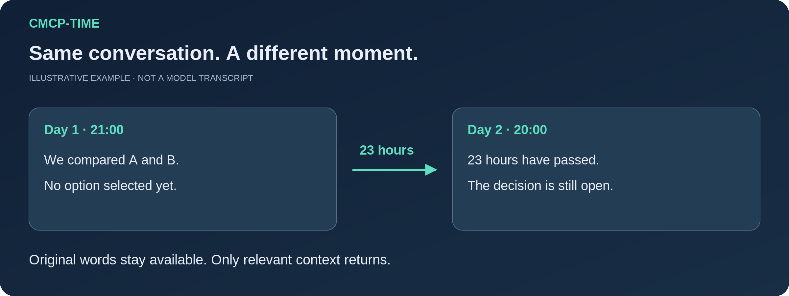
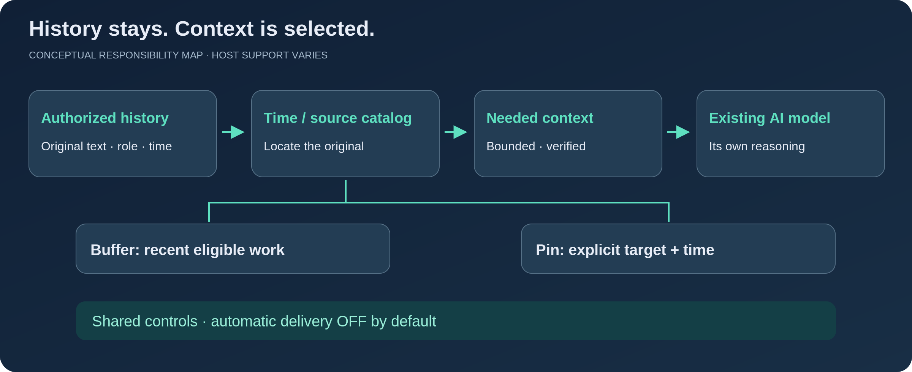

# CMCP-TIME

### Keep the original words. Understand the time between them.

[English](README.md) · [繁體中文](README.zh-TW.md) · [Español](README.es.md) · [日本語](README.ja.md)

**A time-aware continuity skill for AI agents.** CMCP helps an existing agent resume an earlier discussion using the right source, original time and current state, without putting the entire conversation history back into every prompt.

**Local npm candidate `0.1.0-rc.2` · Apache-2.0 · Original author: [redwakame](https://github.com/redwakame)**



## Why it exists

Yesterday's proposal is not today's decision. An answer already delivered is not an unfinished drafting task. A conversation that leaves the context window is not a reason to discard its original words.

CMCP keeps those distinctions available to the agent. It records authorized text sources with roles and times, maintains a source/time catalog, and supplies a bounded amount of relevant context before an answer. When exact wording matters, it goes back to the original source.

It **does not replace the host model's expertise, reasoning, personality or safety policy**, and it is not an answer-rewriting filter. The model can still make mistakes. The purpose is to give it better-grounded continuity, not to promise perfect memory.

## What you can do in this candidate

| Need | CMCP route | Important boundary |
|---|---|---|
| Resume ordinary conversation after a gap | Per-turn time cards and authorized source capture | Requires enabled controls and a working Runtime/host connection |
| Check what was said and when | Time/source catalog, local candidates and exact reading | Original message time is not automatically the time an event happened |
| See the essentials | **READ**: source-supported outline, time and coverage | An outline does not replace the stored original |
| Inspect the full matching discussion | **READ-ALL**: a frozen authorized collection, paged | Not every account, all similar topics or a top-k list called “all” |
| Check or count ordinary past reports | Bounded batch lookup/count with resumable coverage | A mention, a plan and an actual User report are different |
| Keep recent unfinished work available | **Buffer**, default 12 hours, configurable 6–48 | Expiry/Clear does not delete History or independent Pins |
| Pin a specific follow-up | **Pin**, explicit target and optional chosen time | No time means no automatic reminder; delivery is not completion |
| Control intervention | Separate saving, recall, time, Buffer, Pin, Clean, OFF and DND controls | Automatic delivery is **OFF by default** |

No vector database or embedding-model download is required by this candidate. Local lookup and model-assisted semantic interpretation already exist; this is not a claim of exhaustive semantic recall.

## How the pieces fit



**History** preserves authorized source text. The **time/source catalog** locates it. **Buffer** represents recent eligible continuity, while **Pins** represent explicitly chosen targets. These are different responsibilities, not four copies of the same conversation.

The catalog is independent of expiring Buffer entries and can be accessed from the continuity workflow. Ordinary conversation can remain outside Buffer and still be found later. Only the material needed now goes to the model. User decisions, Assistant proposals and unknown event times stay distinguishable.

## Get the source

Use the dedicated repository, not an old development checkout:

```sh
git clone https://github.com/redwakame/CMCP-TIME.git
cd CMCP-TIME
```

GitHub CLI: `gh repo clone redwakame/CMCP-TIME`  
SSH: `git clone git@github.com:redwakame/CMCP-TIME.git`

Or use GitHub **Code → Download ZIP** and extract it into a writable directory. Release tags/assets identify published snapshots when available. This source release does **not** imply an npm-registry publication; do not assume `npm install cmcp` obtains this project.

## Install the local npm candidate

The proposed package is `@redwakame-skill/cmcp-time`; **it is not yet published to npm**. Install the supplied `.tgz` into a persistent user-writable prefix, then run `cmcp-time setup --workspace <existing-workspace>`. Program assets and saved data are separate. On Windows the command is `<prefix>/cmcp-time.cmd`; on POSIX it is `<prefix>/bin/cmcp-time`. Follow the [complete npm installation and update guide](docs/npm-installation.md) for exact commands. Persistent `npx` Hook/Skill installation is not supported. Installation itself does not attach a Host, access History, authorize paid calls or enable proactive delivery.

## Start with the setup wizard

Have Node.js available first. The declared minimum is Node 18; the reported Windows candidate setup used **Node 24.18.0, PowerShell 7.6.6 and Codex CLI 0.154.0**. A version declaration is not a full version/platform test matrix.

```sh
node scripts/cmcp-setup.mjs --help
node scripts/cmcp-setup.mjs --root local-data/my-cmcp --host-workspace local-data/my-cmcp-host
```

The wizard asks about saving, authorized scope, timezone, language and features. It configures CMCP and optional project-local Codex hooks. **It does not install Node or an agent, authenticate accounts, enable paid usage, or silently authorize proactive messages.** No npm runtime dependencies need installing.

**Codex route:** select host mode and review the generated hook commands in Codex. This route uses the host's model; a DeepSeek key is not required. See [quick start](docs/quick-start.md) and [host/version boundaries](docs/installation-and-hosts.md).

**Standalone Playground route:** needs an explicitly configured provider, protected credential and finite authorization. The currently documented configured credential path depends on **Windows DPAPI and PowerShell 7**. DeepSeek is the implemented reference path, not the definition of the CMCP core. See [configuration](docs/configuration.md).

## The controls are part of the product

These commands belong to **CMCP Playground**, not every host's native command parser:

```text
/controls
/read What did we discuss about the delivery plan yesterday?
/read-all Show the full matching delivery-plan discussion.
/next
/set bufferRetentionHours 24
/proactive off
/pins
/clean on
```

Pin an event using the actual number returned by `/topics`, or use `/pin-source` with a registered source. `/pin-time`, `/pin-complete` and `/pin-cancel` manage its lifecycle. Command parameters and examples are in the [complete command reference](docs/commands.md); do not guess internal IDs.

Automatic follow-up requires a running Runtime and delivery channel. Eligible Buffer work and explicitly timed Pins share the master switch, DND, source checks and deduplication. Console presentation is not a phone notification, proof of reading or an always-on service.

## What has and has not been demonstrated

This is a **usable engineering release candidate**, not a blanket production-readiness guarantee. The accompanying records distinguish program controls, exact source reading, model semantics and host integration. See [verification and known limits](docs/verification.md).

The reviewed baseline includes bounded recall, per-turn time cards, separate controls, local Buffer/Pin delivery and a tested Codex hook/manual-compaction path. Candidate packaging also received real Windows setup/helper checks under a non-administrator token. Local fixture tests are not fresh live-model evidence.

**Not claimed:** all hosts, all operating systems, automatic-compaction reliability, unlimited history/index capacity, flawless model interpretation, cloud synchronization, mobile delivery, or complete History-deletion governance. Claude Code, OpenClaw, Hermes, DeepSeek Harness and Grok Bot remain adaptation targets, not an all-green compatibility list. Four-language documentation is not four-language behavioral certification.

## Documentation and contribution

[Quick start](docs/quick-start.md) · [All commands](docs/commands.md) · [Configuration](docs/configuration.md) · [Hosts & installation](docs/installation-and-hosts.md) · [Design](docs/design.md) · [Privacy](docs/privacy.md) · [Verification](docs/verification.md)

Ideas, reproducible issues, independent evaluation and collaboration are welcome. Keep private conversations and credentials out of public reports. Read [CONTRIBUTING](CONTRIBUTING.md), [SECURITY](SECURITY.md) and the [roadmap](docs/roadmap.md).

## Author and license

Created and maintained by **redwakame**. Current project-authored distribution: [Apache-2.0](LICENSE), subject to the retained [NOTICE](NOTICE) and [upstream provenance](docs/license-provenance-v0.1.md). Earlier permissions are not revoked. The internal compatibility identifier remains `cmcp`; the public name is **CMCP-TIME**.

[CITATION.cff](CITATION.cff) provides a convenient citation. No additional per-use advertising requirement is added. Public sources contain no personal History, credentials, development transcripts or model weights.
