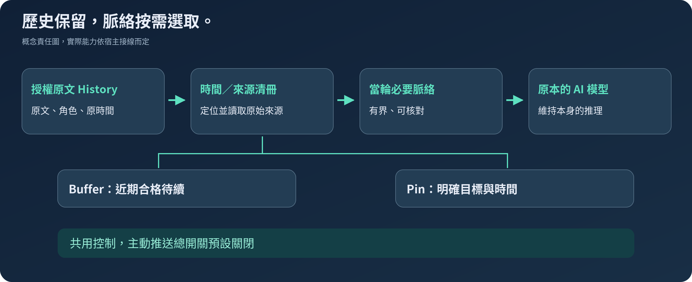

# CMCP-TIME

### 原話留得住，時間接得上。

[English](README.md) · [繁體中文](README.zh-TW.md) · [Español](README.es.md) · [日本語](README.ja.md)

**為既有 AI 智能體補上時間接續能力的技能。** CMCP 協助模型帶著正確的來源、原時間與當前狀態接續討論，不必每輪重新塞入整段歷史。

**預發布候選版 · Apache-2.0 · 原作者：[redwakame](https://github.com/redwakame)**

## 三個一看就懂的使用情境

| 你遇到的情況 | CMCP 補上的能力 |
| --- | --- |
| 隔天回來，只想修改昨天草稿的其中一項。 | 定位對應原稿與版本，不只依模糊摘要重新編一份。 |
| 隔了一段時間才接著聊。 | 提供原始交流時間與經過間隔，不替你猜中間做了什麼。 |
| 工作先暫停，或明確釘選之後要跟進的事項。 | 暫存與釘選分開管理，保留獨立開關；自動推送預設關閉。 |

這些是用途示意，不是錄製的模型輸出。仍須具備可取得的授權來源與正常宿主接線；模型解讀依然可能出錯。

**先從已有文件的 Codex 路徑或獨立 Playground 開始。** 核心不綁宿主，不表示每一款智能體都已接好。[開始安裝](#start-here) · [指令與開關](docs/commands.md) · [宿主界線](docs/installation-and-hosts.md)。


## 為什麼做 CMCP？

昨天提出的方案，不等於今天已經決定。已經交付的草稿，不該再次被當成還沒開始的工作。對話離開模型的上下文，也不應讓原話失去日後查找的機會。

CMCP 保留獲授權的對話原文、角色與時間，透過時間／來源清冊定位，在回答前提供當下需要的有限脈絡。需要精確內容時，再回到原始來源，而不是拿摘要補成原話。

**它不是另一個模型，也不替換宿主模型的專業知識、推理、人格或安全政策。**它不在回答後重寫成固定語氣。模型仍可能判斷錯誤；CMCP 的目的是提供可靠接續材料，不是保證永不遺忘或永不出錯。

## 這個版本能做什麼？

| 需求 | 使用方式 | 必須分清的界線 |
|---|---|---|
| 隔一段時間回來，接續普通聊天 | 每輪時間卡與授權來源保存 | 要有啟用的功能和實際接通的 Runtime／宿主 |
| 找回以前說過的內容與時間 | 時間清冊、本機候選及精確來源讀取 | 訊息時間不直接等於事情發生時間 |
| 先看命中內容的大綱 | **READ**：有來源支持的大綱、時間與範圍 | 摘要不覆寫原文 |
| 查看完整命中脈絡 | **READ-ALL**：界定並凍結集合，再分頁 | 不冒稱整個帳戶或所有相似話題 |
| 查證或統計普通歷史 | 分批查證／計數，可看覆蓋與續查 | 提及、計畫、否定與使用者實際回報不同 |
| 保留近期值得接續的內容 | **Buffer**：預設 12 小時，可調 6–48 小時 | 到期或 Clear 不刪原文，不取消獨立 Pin |
| 明確釘選一個目標 | **Pin**：指定目標，可自訂時間 | 沒設時間不自行提醒；發送不等於完成 |
| 決定 AI 何時介入 | 保存、時間、回查、Buffer、Pin、Clean、OFF、勿擾分別控制 | 主動推送總開關首次**預設關閉** |

本候選不需要向量資料庫或下載 Embedding 模型；已有本機定位與模型參與的語意判讀，但不宣稱任意語意查詢都能零遺漏。

## 原文、時間、暫存與釘選，各有責任



**History** 保存獲授權的原文；**時間／來源清冊**負責定位；**Buffer** 管理近期合格的接續內容；**Pin** 保存使用者明確釘選的目標。不是把同一份對話複製成四套記憶。

清冊獨立於會到期的 Buffer 候選，但可從接續流程調用。普通聊天沒有進 Buffer，仍可在之後回查。模型只收到本輪必要資料；使用者決定、Assistant 提案與未知事件時間不能互相冒充。

<a id="start-here"></a>
## 安裝、設定與開始使用

**正式 npm 套件：**[`@redwakame-skill/cmcp-time`](https://www.npmjs.com/package/@redwakame-skill/cmcp-time)。**命令：**`cmcp-time`。**原始碼倉庫：**`redwakame/CMCP-TIME`。

npm 的 `0.1.0-rc.2` 已經發布。GitHub 原始碼版本、npm 版本與可移動的標籤是不同識別；候選通道用 `@next`，要重現該已發布基準則用 `@0.1.0-rc.2`。`latest` 不是穩定性認證；rc.2 發布核對時，`next` 和 `latest` 都指向 rc.2。

**這份文件隨 `0.1.0-rc.3` 提供**，包含 `context --help` 與文件更新。準備時的 2026-09-22（Asia/Taipei）發布同步預檢確認，已發布基準 rc.2 同時位於 `next` 和 `latest`。實際發布可用性須另行核對：使用 rc.3 help 前，請查閱 registry／當時的 `@next`，並以 `--version` 確認已安裝版本。詳見[版本說明](RELEASE-NOTES.md)。

### 先安裝，再啟動精靈

下例使用 Windows PowerShell。先進入希望放置安裝與資料目錄的位置，選新目錄或已確認用途的位置；不需要管理員，不修改系統 PATH。

```powershell
$cmcpPrefix = Join-Path $PWD 'cmcp-install'
$cmcpWorkspace = Join-Path $PWD 'cmcp-workspace'
New-Item -ItemType Directory -Force -Path $cmcpPrefix, $cmcpWorkspace | Out-Null
npm.cmd install --global --prefix "$cmcpPrefix" @redwakame-skill/cmcp-time@next --ignore-scripts --no-audit --no-fund
& (Join-Path $cmcpPrefix 'cmcp-time.cmd') --version
& (Join-Path $cmcpPrefix 'cmcp-time.cmd') setup --workspace "$cmcpWorkspace"
& (Join-Path $cmcpPrefix 'cmcp-time.cmd') status --workspace "$cmcpWorkspace"
```

安裝指令取得套件，`setup` 才啟動互動式設定精靈，讓你確認保存範圍、時區、語言及選配功能。**安裝不等於授權讀取私人對話、允許模型付費呼叫，也不會替你開啟主動推送。**

發布驗收已完成匿名 registry 安裝；上方持久 global-prefix 配置則有前一輪同內容 Windows 候選驗收。這些不是全平台測試。詳見 [npm 安裝指南](docs/npm-installation.md)。

**使用 Codex：**選 host 模式，再在 Codex 審閱生成的專案 Skill／Hook，使用宿主原本的模型，不必另設 DeepSeek Key。**獨立 Playground：**configured-provider 模式需明確供應商、受保護憑證與有限調用授權；目前隨附的憑證路徑仍依賴 Windows DPAPI／PowerShell 7。DeepSeek 是已實作的參考路徑，不是 CMCP 的產品限制。

### 更新或停用，不把歷史一起刪掉

套件與工作區分開保存。在同一 prefix 安裝核准的新版本後，用 `cmcp-time update --workspace <你的工作區>` 更新受管理接線；`update` 本身不下載新版。`disable` 停用受管理 Hook，`uninstall` 移除受管理接線，兩者都不是刪除獨立 History 工作區。不要把長期 Hook 綁在 `npx` 暫存位置。詳見[完整指令](docs/commands.md)與[設定說明](docs/configuration.md)。

### 也可以直接取得原始碼

```sh
git clone https://github.com/redwakame/CMCP-TIME.git
cd CMCP-TIME
```

亦可用 `gh repo clone redwakame/CMCP-TIME`、SSH `git clone git@github.com:redwakame/CMCP-TIME.git`，或 GitHub **Code → Download ZIP**。要固定內容，請選[發布標籤](https://github.com/redwakame/CMCP-TIME/releases)；`main` 可能另有較新的文件。不要把 `npm install cmcp` 當成本專案的完整套件名稱。

在原始碼根目錄啟動：

```sh
node scripts/cmcp-setup.mjs --help
node scripts/cmcp-setup.mjs --root local-data/my-cmcp --host-workspace local-data/my-cmcp-host
```

Node.js 需另行準備。套件宣告最低 Node 18；npm 安裝驗收使用 Windows、Node 24.18.0、npm 11.16.0、PowerShell 7.6.6，既有 Codex 接線證據採 CLI 0.154.0。這是有版本範圍的紀錄，不是全部版本相容性保證。精靈不自動安裝 Node 或智能體；本候選沒有 npm 執行期依賴，也不要求下載 Embedding 模型權重。

## 不只有 READ，控制也是產品的一部分

以下是 **CMCP Playground** 指令，不是所有宿主原生介面都接受的命令：

```text
/controls
/read 昨天關於運送方案談到哪裡？
/read-all 展開運送方案的完整命中討論。
/next
/set bufferRetentionHours 24
/proactive off
/pins
/clean on
```

先用 `/topics` 取得實際事件編號，再 `/pin`；或以正式來源 ID 使用 `/pin-source`。改時間、完成與取消分別是 `/pin-time`、`/pin-complete`、`/pin-cancel`。完整參數見[指令表](docs/commands.md)與[繁中操作指南](docs/operations.zh-TW.md)，不用猜內部識別碼。

主動呈現需要 Runtime 與通道運作。合格 Buffer 候選和自訂時間的 Pin，共用總開關、勿擾、來源檢查及去重。終端機顯示一則訊息，不代表手機收到、使用者已讀或程式能在關機後運作。

## 版本與驗收界線

目前是**可使用的工程候選版**，不是完整產品無缺陷保證。[驗收與已知限制](docs/verification.md)分開列出程式、原文、模型語意與宿主證據。

已核對的基準包含有限原文回查、每輪時間卡、獨立控制、本機 Buffer／Pin 派送，以及 Codex Hook／手動壓縮路徑；公開候選另有一般 Windows token 下的真實精靈及 helper 檢查。合成測試不冒充新一輪真模型驗收。

**尚未宣稱：**所有宿主、所有作業系統、自動壓縮全面可靠、無限容量、完美理解、雲端同步、手機推送及完整 History 刪除治理。Claude Code、OpenClaw、Hermes、DeepSeek Harness、Grok Bot 保留接入方向，不列成全部已實測。四語文件也不是四語行為全面認證。

## 三個倉庫，現在該看哪一個？

**CMCP-TIME 是目前開發主線。** [OpenClaw Continuity](https://github.com/redwakame/openclaw-continuity) 保留早期 OpenClaw 專用技能；[cmcp](https://github.com/redwakame/cmcp) 保留早期政策契約與審閱成果。原程式、授權及驗收紀錄各自保留，不合併成相同版本。新版沒有宣稱可直接替換舊 OpenClaw 技能，也不會自動搬移使用者資料。

## 參與與授權

歡迎提出可重現問題、使用回饋、獨立驗證與合作。請勿把私人聊天、金鑰或完整資料目錄貼到公開 Issue。詳見[貢獻方式](CONTRIBUTING.md)、[安全說明](SECURITY.md)、[隱私與資料](docs/privacy.md)及[後續方向](docs/roadmap.md)。

原作者與維護者為 **redwakame**。目前專案發布採 [Apache-2.0](LICENSE)，保留 [NOTICE](NOTICE) 與[上游授權沿革](docs/license-provenance-v0.1.md)。舊版本已授出的權利不撤銷；內部相容識別仍為 `cmcp`，對外名稱為 **CMCP-TIME**。[CITATION.cff](CITATION.cff) 提供方便引用的資訊，不新增每次使用都必須宣傳作者的條款。
