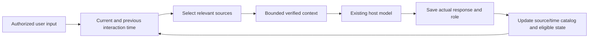
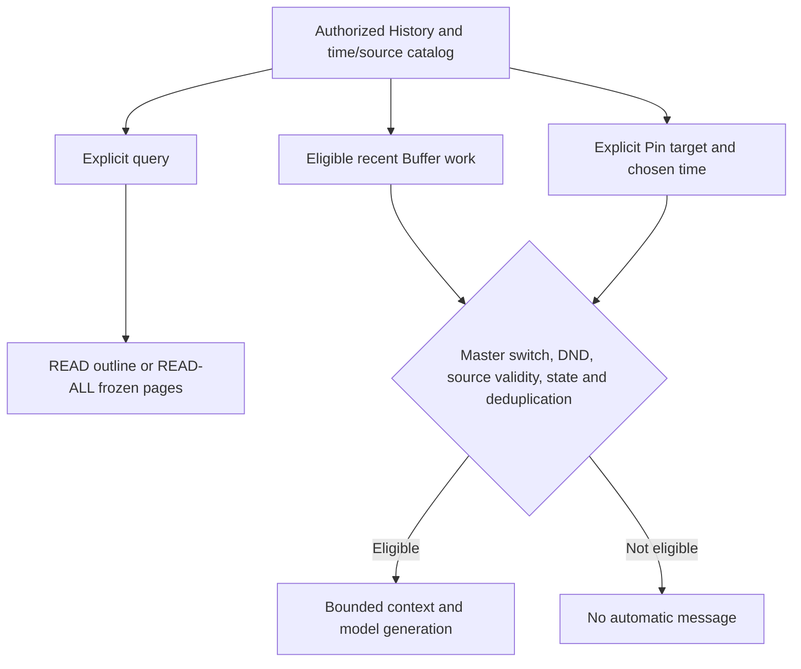

# Design: time belongs to the conversation, not just the clock

CMCP-TIME is a Skill-first integration of temporal continuity and memory governance. The following explains the intended responsibilities of the implemented components, not a guarantee that every host or failure scenario has been validated.

## Three distinctions

**History is broader than active continuity.** An ordinary conversation can remain outside Buffer and still have original text, a role, a Session and a time. Ending a discussion or expiring a candidate is not deletion.

**A time index is not the original.** Locators and summaries help find source material. Exact claims need an authorized reader and the corresponding source version. Not found in a limited set is not proof of absence across all history.

**Source correctness is not semantic truth.** A User can report a plan; an Assistant can propose a draft. Saving either exactly does not establish that the plan happened or the draft was adopted.

## Before and after a turn

The current User source and a proactive job's historical support source are different. Excluding the just-saved foreground input when computing a previous interaction must not exclude the last actual User from a proactive request. Assistant responses have their own observed completion time and do not refresh User activity.

Message time, event occurrence time, operation time, last User/relevant interaction, activation and expiry are distinct. Unknown event time stays unknown. Elapsed duration and local date boundaries use the effective timezone, not a hard-coded country.

## Optional activity

The active Runtime and a delivery channel must exist. Neither a clock tick nor a long silence requires a message. Reading does not by itself grant automatic-delivery permission. Existing independent controls and finite budgets remain effective before generation and presentation.

## Scope today

The core and reference Runtime expose these boundaries; the managed host implementation targets Codex project hooks/skills. Other hosts need their actual capabilities and source identities mapped. Model-assisted selection is present, but an embedding retrieval layer or automatic reflection-to-memory engine is not included. Details and limits are in [verification](verification.md) and [installation](installation-and-hosts.md).
